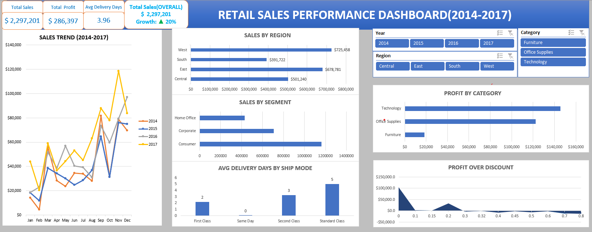

# 📊 Retail Sales Performance Analysis (2014–2017)

## 📌 Project Overview
This project analyzes retail sales data using Excel to uncover business insights related to sales trends, profitability, customer segments, and regional performance.

---

## 🔧 Tools Used
- Microsoft Excel
- Pivot Tables
- Data Cleaning
- Dashboard Design

---

## 📈 Key Metrics
- Total Sales: $2.29M
- Total Profit: $286K
- Growth: 20%
- Avg Delivery Days: 3.96

---

## 🔍 Key Insights
- Technology category is most profitable
- High discounts lead to losses
- West region generates highest sales
- Consumer segment contributes most revenue
- Sales peak in November & December

---

## 📊 Dashboard

---

## 📁 Files Included
- Excel Dashboard File
- Project Report (PDF)
- Visualizations

---

## 👤 Author
Raju Bandham
